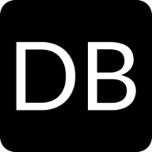

# CS4610-Project-1

- Base objective
- Stretch objective
- Software
- Features
- Basic Setup
- Assumptions
- Premises
- Successes/Failures
- Conclusion

<!-- PROJECT LOGO -->
 

    
    <h3 align="center">University Portal</h3>
    

        A PHP CRUD interface!
         
        <a href="https://github.com/jaredible/CS4610-Project-1"><strong>Explore the docs &#187;</strong></a>
         
         
        <a href="https://umsl.jaredible.net/cs/4610/project/1">View Demo</a>
        <a href="https://github.com/jaredible/CS4610-Project-1/issues">Report Bug</a>
        <a href="https://github.com/jaredible/CS4610-Project-1/issues">Request Feature</a>
    

